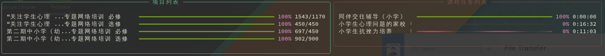
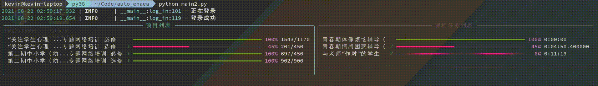

# 教育干部网络学院自动学习

不会抓包不会解析请求，所以用selenium实现一个
**如果未来页面出现变动，需要重新定位代码中的xpath**

## 安装
```bash
pip install -r requirements.txt
```
另外请自行安装webdriver，例如chromedriver，geckodriver


## 使用
```bash
python main.py -u username -p password
```

或者

```bash
python main.py --auto-login
```

## 截图


